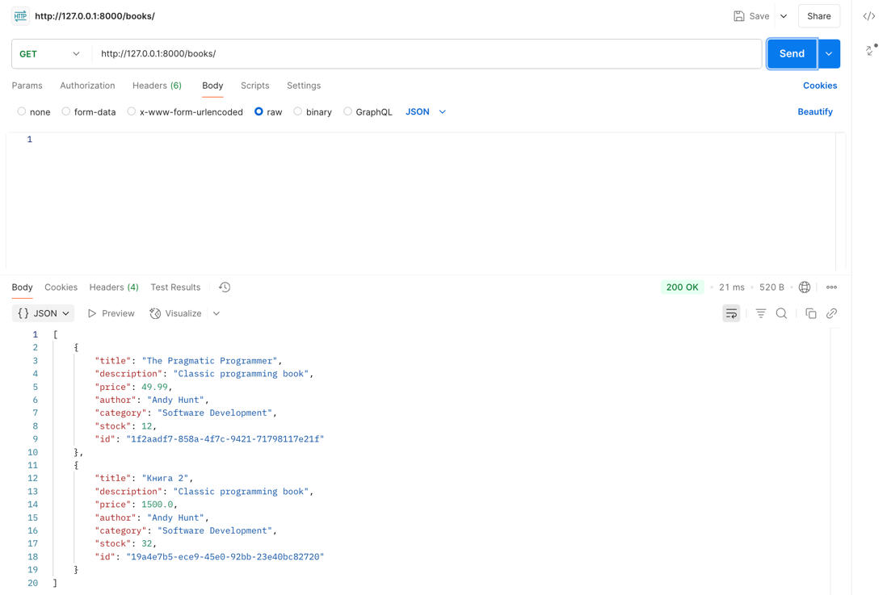
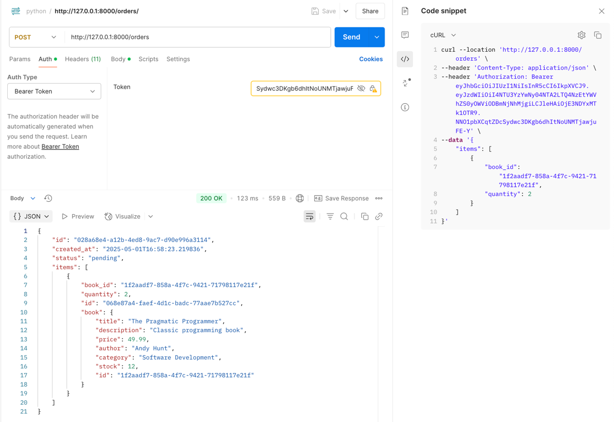

# Как запустить?

```bash
# 1. Запустить БД
docker compose up -d

# 2. Установить venv и зависимости
python3 -m venv venv
source venv/bin/activate 
pip install -r requirements.txt

# 3. Запустить FastAPI
uvicorn app.main:app --reload

# 4. Тесты
pytest

# 5. Pylint
pylint app > pylint.txt
```
# API Примеры запросов

## 1. Регистрация пользователя

```bash
curl -X POST http://127.0.0.1:8000/auth/register \
  -H "Content-Type: application/json" \
  -d '{
        "username": "tansh",
        "email": "tansh@example.com",
        "password": "mysecurepass"
      }'
```

## 2. Логин и получение токена

```bash
curl -X POST http://127.0.0.1:8000/auth/login \
  -H "Content-Type: application/json" \
  -d '{
        "email": "tansh@example.com",
        "password": "mysecurepass"
      }'
```

**Ответ:**

```json
{
  "access_token": "eyJhbGciOiJIUzI1NiIsInR...",
  "token_type": "bearer"
}
```

## 3. Получение текущего пользователя (нужен токен)

```bash
curl -X GET http://127.0.0.1:8000/users/me \
  -H "Authorization: Bearer <TOKEN>"
```

## 4. CRUD по книгам

### Создание книги

```bash
curl -X POST http://127.0.0.1:8000/books/ \
  -H "Content-Type: application/json" \
  -d '{
        "title": "The Pragmatic Programmer",
        "description": "Classic programming book",
        "price": 49.99,
        "author": "Andy Hunt",
        "category": "Software Development",
        "stock": 12
      }'
```

### Получение списка книг

```bash
curl -X GET http://127.0.0.1:8000/books/
```



### Получение книги по ID

```bash
curl -X GET http://127.0.0.1:8000/books/<BOOK_ID>
```

### Обновление книги по ID

```bash
curl -X PUT http://127.0.0.1:8000/books/<BOOK_ID> \
  -H "Content-Type: application/json" \
  -d '{
        "title": "The Pragmatic Programmer (Updated)",
        "description": "Updated description",
        "price": 45.99,
        "author": "Andy Hunt",
        "category": "Software Engineering",
        "stock": 15
      }'
```

### Удаление книги

```bash
curl -X DELETE http://127.0.0.1:8000/books/<BOOK_ID>
```

## Проверка токена

Если токен неправильный или не указан — `/users/me` вернёт:

```json
{
  "detail": "Not authenticated"
}
```

HTTP статус: `401 Unauthorized`

## Создать заказ

```bash
curl -X POST http://127.0.0.1:8000/orders/ \
  -H "Content-Type: application/json" \
  -H "Authorization: Bearer <TOKEN>" \
  -d '{
        "items": [
          {
            "book_id": "<BOOK_ID>",
            "quantity": 2
          },
          {
            "book_id": "<ANOTHER_BOOK_ID>",
            "quantity": 1
          }
        ]
      }'
```



## Получить свои заказы

```bash
curl -X GET http://127.0.0.1:8000/orders/my \
  -H "Authorization: Bearer <TOKEN>"
```